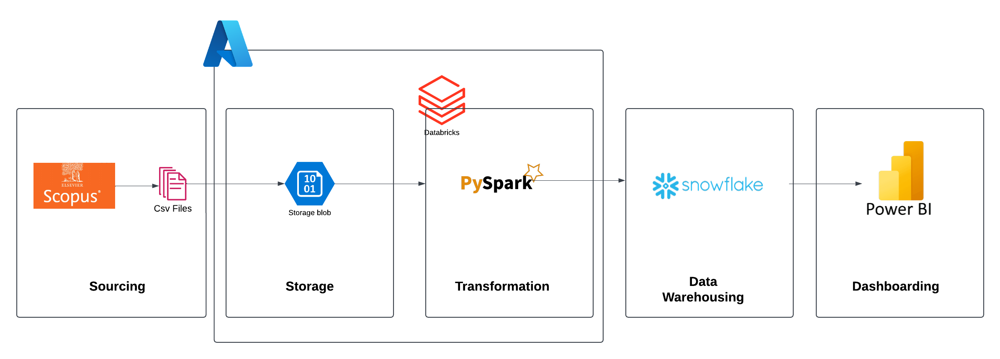
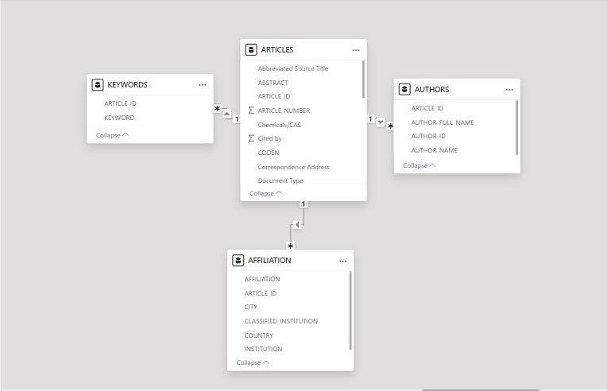

# 🚀 Project: Scholarly Insights Explorer! 📚🔍

Welcome aboard! This project is your trusty guide to navigating the vast world of academic publications, using data from Scopus. 📜✨ We've built a data pipeline that takes raw research data, cleans it up, and structures it for insightful analysis. Let's dive in! 🌊

## 🎯 Project Goals

*   Extract and process data from Scopus to gain meaningful insights. 🧐
*   Create a scalable and robust data pipeline. 💪
*   Structure the data for efficient querying and reporting. 📊
*   Uncover hidden patterns and trends in academic research. 🕵️‍♀️

## ⚙️ Project Architecture

Our pipeline is like a well-oiled machine! Here's a high-level overview:

 

**Key Stages:**

1.  **Sourcing:** 📦 Data is extracted from Scopus in CSV format.
2.  **Storage:** ☁️ Raw data is safely stored in Azure Blob Storage.
3.  **Transformation:** ✨ PySpark in Databricks is used to clean, transform, and structure the data.
4.  **Data Warehousing:** 💾 Transformed data is loaded into Snowflake for secure and scalable storage.
5.  **Dashboarding:** 📊 Power BI brings the data to life through visualizations and dashboards.

## 🗂️ Data Modeling

The transformed data is structured into a star schema, optimized for analysis. Here's the layout:

 

**Core Tables:**

*   **`ARTICLES` (Fact Table):** Contains general information about publications, like titles, abstracts, citation counts, and more. 📚
*   **`KEYWORDS` (Dimension Table):** Lists the keywords associated with each article. 🔑
*   **`AUTHORS` (Dimension Table):** Contains names and IDs of the authors of the articles. ✍️
*   **`AFFILIATIONS` (Dimension Table):** Stores author affiliations, including the institution, city, and country. 🏢🗺️

**Relationships:**

*   All dimension tables relate back to the `ARTICLES` table using one-to-many relationships. 🔗

## 🛠️ Technologies Used

*   **Data Sources:** Scopus (CSV files) 📜
*   **Cloud Storage:** Azure Blob Storage ☁️
*   **Data Processing:** Databricks with PySpark ✨
*   **Data Warehousing:** Snowflake ❄️
*   **Data Visualization:** Power BI 📊

## 📝 Transformation Steps

Our PySpark script is a data wrangling masterpiece! Here are some key steps:

*   **Data Type Casting:** Ensuring data columns have the correct type. 🧙‍♂️
*   **Data Cleaning:** Removing invalid characters and standardizing strings. 🧹
*   **Data Enrichment:** Adding useful columns by splitting and combining existing data. 🧬
*   **Table Splitting:** Decomposing the original data into four related tables for a relational structure. 🧩

## 🚀 Let's Dive into the Code!

For detailed code, check out our PySpark transformation script. It is where all the magic happens! ✨
It takes data from Scopus and creates four different tables, handling null values and splitting different fields into arrays.

## 💡 Potential Use Cases

*   Uncovering trends in academic research. 📈
*   Tracking the impact of different publications. 📊
*   Analyzing collaboration networks between authors. 🤝
*   Exploring research topics and keywords. 🔍

## 🎉 Conclusion

We hope you find our Scholarly Insights Explorer fun and useful! 🚀 Let us know your feedback and happy exploring! 🎉

Feel free to reach out if you have any questions or want to know more about the project! 💬
